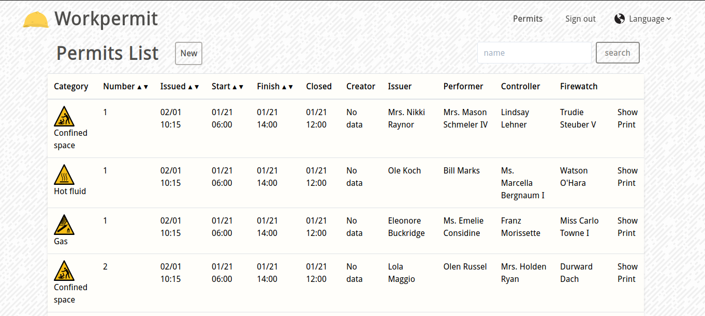
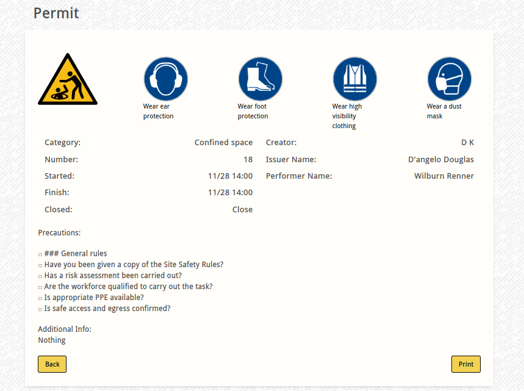

# Demo Elixir/Phoenix app for creating permits to work that can be exported to pdf
## Technologies used
- Elixir/Phoenix
- Postgres/Ecto
- TurboEcto - custom fork with tailwind support
- LiveView/LiveDashboard
- Alpine js
- Tailwind css

## Demo images

To start your Phoenix server:

  * Install dependencies with `mix deps.get`
  * Create and migrate your database with `mix ecto.setup`
  * Install Node.js dependencies with `cd assets && npm install`
  * Start Phoenix endpoint with `mix phx.server`

Now you can visit [`localhost:4000`](http://localhost:4000) from your browser.
